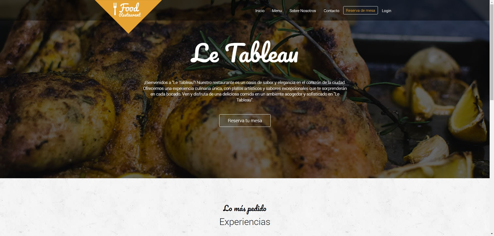
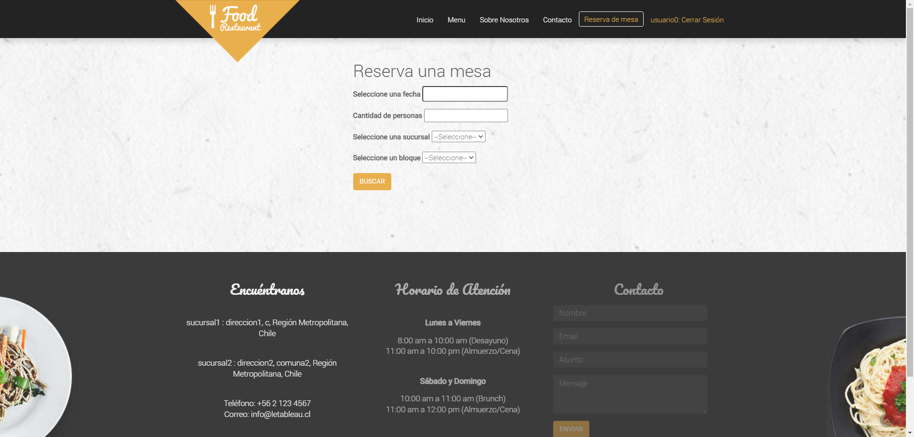

# django-leTableau

Proyecto final para la carrera de Analista Programador año 2023.

## Instalación
    
Ejecuta estos comandos en terminal

* `pip install -r requirements.txt`

* `python manage.py makemigrations`

* `python manage.py migrate`

* `python manage.py runserver`

[Abrir la página](http://127.0.0.1:8000/)

## Overview
    
La página consta de una reserva de mesas y un registro de usuarios para los clientes.

En el admin podrás encontrar una administración de los locales de dicho restaurant, puedes ingresar con las siguientes credenciales:

* `User: admin`

* `Pwd: admin`

## Tecnologías
* Python
* Django
* Bootstrap
* JavaScript
* SCSS    
  
## Screenshots : 

